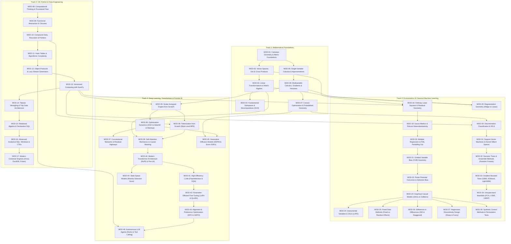

# OKVIR: THE DEFINITIVE MASTER PRD AND CURRICULUM BLUEPRINT
> **System Document ID:** `OKVIR-PRD-CURRICULUM-2026-V1`  
> **Status:** Ratified Production Blueprint & Pedagogical Architecture  
> **Classification:** Public Technical Specification / Open-Source Sovereign Standard  
> **Authors:** Okvir Autonomous Swarm (Pedagogical Systems Design, Academic Research, and Engine Engineering Divisions)  
> **Target Platform:** Native Desktop (Tauri v2 + Rust) · In-Browser WASM (Pyodide 0.26 / DuckDB) · Local-First SQLite (WAL Mode)

---

## 1. Executive Summary & Vision

### 1.1 Mission Philosophy
**OKVIR** is an open-source, sovereign, local-first interactive desktop learning framework designed to take learners from **absolute elementary first principles** (no prior programming knowledge, basic arithmetic only) to **frontier artificial intelligence, econometrics, and quantitative research mastery**.

The framework is founded on four foundational pedagogical and technical invariants:
1. **Zero Unearned Cognitive Jumps:** Every abstraction must be earned through prior physical or spatial intuition. If an equation introduces a partial derivative, earlier lessons must have physically grounded slopes, secant lines, limits, and directional slicing. If a model introduces multi-head self-attention, previous lessons must have grounded dot-product projections, query-key routing, and causal masking.
2. **The 4-Beat Micro-Loop:** Every micro-lesson (5 to 8 minutes) enforces an active learning cycle:
   - *Beat 1 (Tactile Intuition):* Interactive 2D/3D Canvas / WebGL simulation.
   - *Beat 2 (Formal Mathematical Anchor):* KaTeX equations with interactive variable highlighting.
   - *Beat 3 (Sandboxed In-Browser Challenge):* Pyodide WebAssembly runtime with automated unit test assertions (`np.testing.assert_allclose`).
   - *Beat 4 (Active Recall Transfer Quiz):* FSRS-4.5 spaced repetition concept card.
3. **Local-First Native Architecture:** Native desktop application (Tauri v2 + Rust), embedded SQLite in WAL mode, zero cloud telemetry, 100% offline functionality.
4. **First-Class Bilingual Pedagogy (English & Arabic):** Built with native bidirectional (LTR/RTL) rendering, contextual font typography (Geist Mono and IBM Plex Arabic / Noto Kufi Arabic), and culturally grounded terminology.

### 1.2 Learner Personas
```
┌───────────────────────────────────────────────────────────────────────────────────────────────────┐
│                                    OKVIR LEARNER SPECTRUM                                         │
└───────────────────────────────────────────────────────────────────────────────────────────────────┘
   Persona 1: The Curious Beginner       Persona 2: The Domain Switcher     Persona 3: Frontier Researcher
   • Background: Non-STEM, zero code     • Background: Software / Business  • Background: Graduate ML / Quant
   • Starting Point: Arithmetic, logic   • Starting Point: Python basics    • Starting Point: Transformers / Math
   • Destination: High-level Data Sci    • Destination: Production ML / IV  • Destination: Mamba, DPO, Agents
   • Entry Barrier: Math phobia          • Entry Barrier: Black-box fatigue • Entry Barrier: Implementation gap
```

- **Persona 1: The Curious Beginner (Layla)**
  - *Profile:* High school student or humanities graduate with no prior programming experience and basic arithmetic skills.
  - *Pain Point:* Traditional courses introduce abstract Python syntax or calculus proofs without tactile geometric grounding, causing immediate drop-off.
  - *Okvir Journey:* Begins at Track 1 (Cartesian coordinates, slopes, geometric displacements) and Track 2 (variables as name-bindings, conditional flow). Interacts with elastic vector handles and interactive number lines before seeing algebraic notation.
- **Persona 2: The Domain Switcher (Omar)**
  - *Profile:* Backend engineer or business analyst who uses pandas or scikit-learn without understanding the statistical assumptions.
  - *Pain Point:* "Black-box fatigue"—can fit models via `.fit()` and `.predict()`, but cannot diagnose collinearity, collider stratification bias, or why OLS standard errors fail under heteroskedasticity.
  - *Okvir Journey:* Engages with Track 2 (vectorization, memory striding, SQL window functions) and Track 3 (residual orthogonality, Gauss-Markov theorem, OVB, IV/2SLS, DiD).
- **Persona 3: The Frontier AI Researcher (Zayd)**
  - *Profile:* Machine learning engineer or graduate student seeking deep mechanical intuition for next-generation generative AI and causal architectures.
  - *Pain Point:* Online tutorials provide surface-level explanations of Transformers or Diffusion without implementing the autograd DAG, FlashAttention online tiling, Mamba associative scans, or DPO closed-form solutions from scratch.
  - *Okvir Journey:* Completes Track 4 (Milestones 1 to 15: autograd DAG, RoPE phasors, FlashAttention, LoRA low-rank factorizations, DPO, Mamba, and ReAct agent loops).

### 1.3 Competitive Teardowns & Strategic Positioning

| Capability / Dimension | Brilliant.org | Khan Academy | Coursera / edX | DataCamp | OKVIR |
| :--- | :--- | :--- | :--- | :--- | :--- |
| **Architectural Model** | Cloud SaaS (Subscription) | Cloud Web (Free non-profit) | Cloud Video LMS | Cloud Web In-Browser | **Local-First Native App (Tauri v2 + Rust)** |
| **Data Privacy & Telemetry** | High telemetry, user tracking | Cloud database tracking | High corporate tracking | Heavy corporate telemetry | **100% Sovereign, Zero Telemetry, Local SQLite** |
| **Mathematical Depth** | Intuitive but lacks formal derivations & code | High school / early college, video-heavy | Proof-heavy, video lectures, detached labs | Shallow API calling (`model.fit()`) | **First-Principles: Intuition $\to$ Formal Derivations $\to$ Bare NumPy** |
| **Execution Environment** | Proprietary interactive UI, no real code | Multiple choice, scratchpad | Hosted Jupyter notebooks (slow, remote) | Hosted Docker containers (network dependent) | **Sub-50ms Sandboxed In-Browser WASM (Pyodide + DuckDB)** |
| **Memory & Spaced Repetition**| Weak (linear tracks) | Skill mastery bars | Zero spaced repetition | Daily XP streaks only | **Native FSRS-4.5 Embedded Spaced Repetition Engine** |
| **Arabic / Multilingual** | English primary, partial translations | Translated subtitles | Subtitles only | English only | **Native Dual LTR/RTL Architecture & Arabic Typography** |
| **Offline Capability** | Limited mobile caching | Video downloads only | Video downloads only | Requires continuous connection | **100% Offline: Zero Network Required Post-Install** |
| **Open Source & Extensible** | Closed source, proprietary | Closed platform | Closed platform | Closed platform | **Dual MIT/Apache-2.0, Open Content DSL (`.okvir.md`)** |

---

## 2. Pedagogical Engine & Learning Science

### 2.1 Cognitive Load Theory (Sweller) & Cognitive Scaffolding
Human working memory is severely bounded, capable of holding only $4 \pm 1$ novel information chunks simultaneously (Sweller, 1988; Cowan, 2001). Traditional educational software imposes heavy **extraneous cognitive load** through complex UI navigation, terminal environment setup, version incompatibilities, and passive video consumption.

Okvir optimizes cognitive load via three mechanisms:
1. **Extraneous Load Elimination:** Zero environment setup. The student writes Python code inside a zero-latency WebAssembly sandbox. All mathematical terms have interactive hover definitions; equations and visualizations update bidirectionally.
2. **Intrinsic Load Management (Faded Scaffolding):** Complex problem spaces are segmented using Renkl & Atkinson's faded scaffolding framework:
   - *Stage 1 (Worked Example & Physical Grounding):* Fully solved algorithm with interactive tactile exploration and Jargon Decoders.
   - *Stage 2 (Guided Skeleton Completion):* Student fills critical computational holes (e.g. vectorization operations, matrix dot products, or residual calculations) with structural guardrails.
   - *Stage 3 (Independent Implementation):* Student constructs the solution from scratch in the full IDE editor with passing test assertions.
3. **Germane Load Maximization:** Working memory is focused on schema construction through the **4-Beat Micro-Loop**.

```
┌───────────────────────────────────────────────────────────────────────────────────────────┐
│                               THE 4-BEAT MICRO-LOOP                                       │
└───────────────────────────────────────────────────────────────────────────────────────────┘
   Beat 1: Tactile Intuition          Beat 2: Mathematical Anchor
   [ 60 FPS Canvas Simulation ]  ──►  [ Interactive KaTeX Equation ]
   • Parameter sliders                • Hover variable breakdown
   • Real-time visual feedback         • Physical coordinate links
                 │                                  │
                 ▼                                  ▼
   Beat 3: WASM Python Scratchpad     Beat 4: Transfer Quiz (FSRS-4.5)
   [ Pyodide In-Browser Test ]   ──►  [ Active Recall Concept Card ]
   • Vectorized implementation        • Deep diagnostic questions
   • np.testing.assert_allclose       • Spaced retention scheduling
```

### 2.2 Socratic 3-Tier Progressive Hint Ladder
When a student fails a code challenge or test assertion, Okvir refuses to provide the raw answer immediately. Instead, it deploys a 3-tier progressive hint ladder:
- **Tier 1 (Conceptual Orientation):** Guides the learner's attention toward the governing physical or geometric intuition without mentioning code syntax.
  - *Example:* *"Notice what happens to the residual line when the slope rotates past the cluster mean. Which direction must the line tilt to reduce total error area?"*
- **Tier 2 (Algorithmic / Mathematical Structure):** Specifies the mathematical identity or NumPy method needed to solve the step.
  - *Example:* *"Recall the normal equation: the residual vector must be orthogonal to the regressor. In NumPy, this inner product is expressed as `np.dot(X.T, residuals)` or `X.T @ residuals`."*
- **Tier 3 (Syntactic / Structural Template):** Provides the code skeleton, leaving only the core expression for the student to complete.
  - *Example:* *"Set `residuals = y - (X @ beta)` and return `float(np.sum(residuals ** 2))`."*

### 2.3 FSRS-4.5 Spaced Repetition Retention Engine
Concepts mastered during Beat 3 and Beat 4 are automatically converted into spaced repetition cards managed by the **Free Spaced Repetition Scheduler (FSRS-4.5)**.

The forgetting curve models the probability of recall (retrievability $R$) as a power-law function of elapsed time $t$ (in days) and memory stability $S$:
$$R(t, S) = \left( 1 + \frac{19}{81} \cdot \frac{t}{S} \right)^{-0.5}$$
*Proof of Consistency:* When $t = S$, $R(S, S) = (1 + 19/81)^{-0.5} = (100/81)^{-0.5} = \sqrt{81/100} = 0.90$. Thus, stability $S$ is the duration in days required for recall probability to decay to exactly 90%.

The optimal review interval $I$ for a target retention probability $R_{\text{target}}$ (default $R_{\text{target}} = 0.85$) is:
$$I(S, R_{\text{target}}) = \text{round}\left( \frac{81}{19} \cdot S \cdot \left( R_{\text{target}}^{-2} - 1 \right) \right)$$
Upon each review, the card's stability and difficulty ($D \in [1, 10]$) update based on user rating ($G \in \{1: \text{Again}, 2: \text{Hard}, 3: \text{Good}, 4: \text{Easy}\}$):
$$D' = \text{clamp}\left( D - w_6 (G - 3), 1, 10 \right), \quad D_{\text{final}} = w_7 D_0 + (1 - w_7) D'$$
$$S'(D, S, R, G) = \begin{cases}
S \cdot \left( 1 + e^{w_8} \cdot (11 - D) \cdot S^{-w_9} \cdot (e^{w_{10}(1 - R)} - 1) \right), & \text{if } G \ge 2 \\
w_{11} \cdot D^{-w_{12}} \cdot \left( (S + 1)^{w_{13}} - 1 \right) \cdot e^{w_{14}(1 - R)}, & \text{if } G = 1 \text{ (Lapse)}
\end{cases}$$

---

## 3. Empirically Discovered Module Taxonomy & Dependency DAG

Synthesized from deep academic syllabi (MIT 18.06/18.01/18.02, Stanford CS229/CS231n/CS224n, UC Berkeley CS61A/Data 8/CS189, Harvard Stat 110, Cunningham, Angrist & Pischke, Hastie et al., Karpathy), the Okvir curriculum spans **4 Integrated Tracks, 38 Core Modules, and 125 Granular Micro-Lessons**.



---

## 4. The Complete Granular Lesson Catalog

Below is the complete catalog across all 4 tracks. Each lesson implements the 4-Beat Micro-Loop with explicit mathematical formulation, visual component binding, and unit test assertions.

### 4.1 Track 1: Mathematical Foundations (29 Lessons)

```
[Track 1 Catalog Overview]
MOD-01: LESSON-T1-01 to 03 (Cartesian Metric, Slopes, Vectors as Geometry)
MOD-02: LESSON-T1-04 to 06 (Linear Combinations, Dot Products, Cross Products)
MOD-03: LESSON-T1-07 to 10 (Linear Maps, Matrix Composition, Determinants, Systems)
MOD-04: LESSON-T1-11 to 15 (Subspaces, Projections, Eigenpairs, Spectral Theorem, SVD)
MOD-05: LESSON-T1-16 to 20 (Limits, Tangents, Chain Rule, Curvature, Taylor Expansions)
MOD-06: LESSON-T1-21 to 25 (Scalar Fields, Partials, Gradient Vectors, Hessians, Jacobians)
MOD-07: LESSON-T1-26 to 29 (Convexity, Gradient Descent, Lagrange Multipliers, CLT)
```

#### Detailed Lesson Breakdowns (Sample Selection from Track 1):

* **Lesson `math-01`: Cartesian Coordinate Systems & The Euclidean Metric**
  - *Core Concept:* Space as a metric continuum; invariance of distance under coordinate translation and rotation.
  - *KaTeX Anchor:*
    $$d(\mathbf{p}, \mathbf{q}) = \|\mathbf{p} - \mathbf{q}\|_2 = \sqrt{\sum_{i=1}^n (p_i - q_i)^2}$$
  - *Visual Simulation:* `VectorGeometryCanvas` (interactive 2D grid; moving point $p$ or $q$ renders dynamic right-angle legs whose squares fuse into the hypotenuse square $c^2$).
  - *Python Challenge:* Implement `euclidean_distance(p: np.ndarray, q: np.ndarray) -> float` without loops.
  - *Assertions:* `np.isclose(euclidean_distance(np.array([1., 2.]), np.array([4., 6.])), 5.0)`.
  - *Transfer Quiz:* Why does rotating coordinate axes by angle $\theta$ preserve Euclidean distance? (Rotational transformation matrix $R$ is orthogonal: $R^T R = I$, preserving inner products).

* **Lesson `math-05`: The Dot Product & Geometric Projection Duality**
  - *Core Concept:* The algebraic sum-of-products equals geometric shadow projection; inner products as coordinate-free operators.
  - *KaTeX Anchor:*
    $$\mathbf{u} \cdot \mathbf{v} = \mathbf{u}^T \mathbf{v} = \|\mathbf{u}\| \|\mathbf{v}\| \cos(\theta), \quad \text{proj}_{\mathbf{u}}(\mathbf{v}) = \left(\frac{\mathbf{u} \cdot \mathbf{v}}{\|\mathbf{u}\|^2}\right) \mathbf{u}$$
  - *Visual Simulation:* `VectorGeometryCanvas` (dragging $\mathbf{v}$ drops a perpendicular light beam onto $\mathbf{u}$; shadow flips direction when $\theta > 90^\circ$).
  - *Python Challenge:* Implement `vector_projection(u: np.ndarray, v: np.ndarray) -> np.ndarray`.
  - *Assertions:* `np.allclose(vector_projection(np.array([2., 0.]), np.array([2., 2.])), np.array([2., 0.]))`.
  - *Transfer Quiz:* When $\mathbf{u} \cdot \mathbf{v} = 0$, what does this guarantee about the angle $\theta$? ($\theta = 90^\circ$ or $270^\circ$, vectors are orthogonal).

* **Lesson `math-15`: Singular Value Decomposition (SVD) & Spectral Geometry**
  - *Core Concept:* Any linear mapping decomposes into rotation $\to$ coordinate stretching $\to$ rotation; low-rank Eckart-Young approximation.
  - *KaTeX Anchor:*
    $$\mathbf{A} = \mathbf{U} \mathbf{\Sigma} \mathbf{V}^T = \sum_{i=1}^r \sigma_i \mathbf{u}_i \mathbf{v}_i^T, \quad \sigma_1 \ge \sigma_2 \ge \dots \ge \sigma_r > 0$$
  - *Visual Simulation:* `SVDImageCompressorLab` (3-stage geometric transform: right singular vectors rotate, singular values stretch unit circle into hyper-ellipse, left singular vectors rotate into codomain).
  - *Python Challenge:* Implement `rank_k_approx(A: np.ndarray, k: int) -> np.ndarray`.
  - *Assertions:* Verifies Frobenius norm reconstruction error against `scipy.linalg.svd`.

* **Lesson `math-23`: The Gradient Vector & Directional Derivatives**
  - *Core Concept:* The gradient vector $\nabla f$ points in the direction of maximum rate of ascent and is everywhere orthogonal to level curves.
  - *KaTeX Anchor:*
    $$\nabla f(\mathbf{x}) = \begin{bmatrix} \frac{\partial f}{\partial x_1} \\ \vdots \\ \frac{\partial f}{\partial x_n} \end{bmatrix}, \quad D_{\hat{\mathbf{u}}} f = \nabla f(\mathbf{x}) \cdot \hat{\mathbf{u}} = \|\nabla f\| \cos(\theta)$$
  - *Visual Simulation:* `GradientDescentCanvas` (contour elevation map; rotating compass needle $\hat{\mathbf{u}}$ calculates directional slope; maximum slope aligns with $\nabla f$).
  - *Python Challenge:* Implement `numerical_gradient(f, x: np.ndarray, eps=1e-5) -> np.ndarray`.
  - *Assertions:* Verified against analytical gradient of 2D Rosenbrock function.

---

### 4.2 Track 2: CS, Python & Data Engineering (30 Lessons)

```
[Track 2 Catalog Overview]
MOD-08: LESSON-T2-01 to 03 (Name-Binding, Control Flow, Environment Frames)
MOD-09: LESSON-T2-04 to 06 (Pure Functions, Higher-Order Functions, Closures)
MOD-10: LESSON-T2-07 to 09 (Recursion Trees, Sequences, Pointer Aliasing vs Cloning)
MOD-11: LESSON-T2-10 to 12 (Hash Tables, Dicts, O(1) Lookups, Big-O Complexity)
MOD-12: LESSON-T2-13 to 15 (Dunder Protocols, Iterators, Lazy Stream Generators)
MOD-13: LESSON-T2-16 to 18 (SIMD Vectorization, Memory Strides, Broadcasting)
MOD-14: LESSON-T2-19 to 22 (DataFrames, loc/iloc, Tidy Data, GroupBy Split-Apply-Combine)
MOD-15: LESSON-T2-23 to 25 (Relational Algebra, SQL Execution Stages, Joins)
MOD-16: LESSON-T2-26 to 28 (Window Functions, LAG/LEAD, Recursive CTEs)
MOD-17: LESSON-T2-29 to 30 (Columnar Parquet, Arrow Zero-Copy, Polars Lazy DAGs)
```

#### Detailed Lesson Breakdowns (Sample Selection from Track 2):

* **Lesson `cs-16`: Vectorized Numerical Computing & SIMD Mechanics**
  - *Core Concept:* Replacing CPython boxed pointer interpretation with contiguous C-memory SIMD register execution.
  - *KaTeX Anchor:*
    $$\text{Speedup } S = \frac{T_{\text{CPython}}}{T_{\text{SIMD}}} = \frac{N(\tau_{\text{dispatch}} + \tau_{\text{unbox}} + \tau_{\text{calc}})}{\frac{N}{W} \tau_{\text{vector}}} \approx 50\times - 200\times$$
  - *Visual Simulation:* `SimdVsLoopBenchmarkLab` (split-screen: scattered pointer heap traversal vs 256-bit AVX2 register packing).
  - *Python Challenge:* Implement `vectorized_squared_error(y: np.ndarray, y_hat: np.ndarray) -> float` without loops.
  - *Assertions:* `vectorized_squared_error(np.array([2., 4.]), np.array([1., 3.])) == 2.0`.

* **Lesson `cs-18`: NumPy Broadcasting Rules & Memory Stride Strata**
  - *Core Concept:* Multi-dimensional array arithmetic without copying memory via zero-stride expansion.
  - *KaTeX Anchor:*
    $$\dim(\mathbf{A} \oplus \mathbf{B})_k = \max(\dim(\mathbf{A})_k, \dim(\mathbf{B})_k) \quad \text{where } \dim(\mathbf{X})_k \in \{d_k, 1\}$$
  - *Visual Simulation:* `BroadcastingAlignmentGrid` (trailing dimensions align right; size 1 dimensions stretch with stride 0).
  - *Python Challenge:* Implement `pairwise_differences(a: np.ndarray, b: np.ndarray) -> np.ndarray`.
  - *Assertions:* `pairwise_differences(np.array([10, 20]), np.array([1, 2, 3]))` yields $(2 \times 3)$ difference matrix.

* **Lesson `cs-26`: Advanced Analytical SQL: Window Functions & Frames**
  - *Core Concept:* Performing calculations across row partitions without collapsing individual row identities.
  - *KaTeX Anchor:*
    $$w_i = f\big( \{ r_j \in \mathcal{P}(\text{row}_i) \mid j \in [\text{start}(i), \text{end}(i)] \} \big)$$
  - *Visual Simulation:* `WindowFunctionFrameLab` (sliding translucent partition brackets calculating rolling aggregations).
  - *Python Challenge (DuckDB):* Write SQL query utilizing `DENSE_RANK() OVER (PARTITION BY dept ORDER BY salary DESC)`.
  - *Assertions:* Executed against in-memory DuckDB table; verifies ranks across tie values.

---

### 4.3 Track 3: Econometrics & Classical Machine Learning (33 Lessons)

```
[Track 3 Catalog Overview]
MOD-18 to 21: LESSON-T3-01 to 08 (OLS Orthogonality, Gauss-Markov, FWL, OVB)
MOD-22 to 24: LESSON-T3-09 to 14 (Potential Outcomes, DAGs, Colliders, IV/2SLS)
MOD-25 to 28: LESSON-T3-15 to 22 (Panel FE, DiD Staggered, RDD Local Linear, Synthetic Controls)
MOD-29 to 31: LESSON-T3-23 to 27 (Ridge/Lasso Geometry, Logistic IRLS, SVM Margins)
MOD-32 to 34: LESSON-T3-28 to 33 (Decision Trees, Random Forests, XGBoost, UMAP)
```

#### Detailed Lesson Breakdowns (Sample Selection from Track 3):

* **Lesson `econ-01`: Bivariate OLS & The Geometry of Orthogonal Residuals**
  - *Core Concept:* OLS as an algebraic projection; the residual vector $\mathbf{e}$ is orthogonal to regressor space $\text{col}(\mathbf{X})$.
  - *KaTeX Anchor:*
    $$\mathbf{X}^T \mathbf{e} = \mathbf{0} \implies \hat{\boldsymbol{\beta}} = (\mathbf{X}^T \mathbf{X})^{-1} \mathbf{X}^T \mathbf{y}, \quad \hat{\mathbf{y}} = \mathbf{P}_X \mathbf{y} = \mathbf{X}(\mathbf{X}^T \mathbf{X})^{-1} \mathbf{X}^T \mathbf{y}$$
  - *Visual Simulation:* `LinearRegressionResiduals` (interactive scatter points with shrinking squared error boxes; dot product meter $\langle \mathbf{x}, \mathbf{e} \rangle$ hits $0.00$ at optimal fit).
  - *Python Challenge:* Implement `compute_ols_normal_equations(X: np.ndarray, y: np.ndarray) -> np.ndarray`.
  - *Assertions:* `np.allclose(X.T @ (y - X @ beta), np.zeros(K), atol=1e-7)`.

* **Lesson `econ-04`: Omitted Variable Bias (OVB) & The Directional Bias Matrix**
  - *Core Concept:* Omitting a confounder biases the treatment estimate by the product of the omitted variable's effect on $Y$ and its regression on $X$.
  - *KaTeX Anchor:*
    $$\text{plim} \, \hat{\beta}_{\text{short}} = \beta_{\text{true}} + \gamma \cdot \pi_1 \quad \text{where } Z = \pi_0 + \pi_1 X + \nu$$
  - *Visual Simulation:* `SimpsonsParadoxLab` (Simpson's reversal; subgroup downward slopes vs aggregate upward slope).
  - *Python Challenge:* Implement `compute_ovb(beta_true, gamma, x, z) -> dict`.
  - *Assertions:* Verifies analytical bias formula against empirical short regression.

* **Lesson `econ-07`: Instrumental Variables & Two-Stage Least Squares (2SLS)**
  - *Core Concept:* Isolating exogenous variation in an endogenous regressor via instrument projection; LATE for compliers.
  - *KaTeX Anchor:*
    $$\hat{\beta}_{\text{2SLS}} = (\mathbf{X}^T \mathbf{P}_Z \mathbf{X})^{-1} \mathbf{X}^T \mathbf{P}_Z \mathbf{y} \quad \text{where } \mathbf{P}_Z = \mathbf{Z}(\mathbf{Z}^T \mathbf{Z})^{-1} \mathbf{Z}^T$$
  - *Visual Simulation:* `InstrumentalVariablesLab` (causal DAG; relevance slider triggers "Weak Instrument" warning when $F < 10$).
  - *Python Challenge:* Implement `fit_2sls(y: np.ndarray, d: np.ndarray, z: np.ndarray) -> dict`.
  - *Assertions:* Checks first-stage $F$-statistic and standard error calculation using true structural residuals.

* **Lesson `ml-10`: Gradient Boosted Decision Trees & XGBoost 2nd-Order Expansion**
  - *Core Concept:* Functional gradient descent fitting trees to pseudo-residuals; exact second-order Taylor leaf weights and split gain.
  - *KaTeX Anchor:*
    $$w_j^* = - \frac{\sum_{i \in I_j} g_i}{\sum_{i \in I_j} h_i + \lambda}, \quad \text{Gain} = \frac{1}{2} \left[ \frac{G_L^2}{H_L + \lambda} + \frac{G_R^2}{H_R + \lambda} - \frac{(G_L + G_R)^2}{H_L + H_R + \lambda} \right] - \gamma$$
  - *Visual Simulation:* `GBMResidualWaterfall` (waterfall chart showing sequential residual reduction across boosting stages).
  - *Python Challenge:* Implement `xgboost_optimal_leaf_weight(g: np.ndarray, h: np.ndarray, lam: float) -> float`.
  - *Assertions:* Verified against analytical leaf weight formula and positive split gain.

---

### 4.4 Track 4: Deep Learning, Transformers & Frontier AI (33 Lessons)

```
[Track 4 Catalog Overview]
MOD-35: LESSON-T4-01 to 03 (Scalar Autograd Engine, Dynamic DAG, Reverse Adjoints)
MOD-36: LESSON-T4-04 to 06 (MLP Activations, Loss Landscapes, AdamW Optimization)
MOD-37: LESSON-T4-07 to 09 (LayerNorm, RMSNorm, CNNs, ResNet Skip Highways)
MOD-38: LESSON-T4-10 to 12 (Recurrent Gates, LSTM Cell Highways, Byte-Pair Encoding)
MOD-39: LESSON-T4-13 to 16 (Scaled Dot-Product Attention, Causal Masking, Multi-Head MHA)
MOD-40: LESSON-T4-17 to 20 (RoPE Phasors, Pre-LN Blocks, SwiGLU, KV Caching)
MOD-41: LESSON-T4-21 to 23 (Grouped-Query Attention, FlashAttention Online Softmax)
MOD-42: LESSON-T4-24 to 26 (Supervised Fine-Tuning, LoRA Low-Rank Decompositions, QLoRA)
MOD-43: LESSON-T4-27 to 29 (RLHF PPO Horizons, DPO Closed-Form Rewards, GRPO Reasoning)
MOD-44: LESSON-T4-30 to 31 (Continuous SSMs, S4, Mamba Selective Associative Scan)
MOD-45: LESSON-T4-32 to 33 (DDPM Markov Noising, Score-Based SDEs, Classifier-Free Guidance)
MOD-46: LESSON-T4-34 to 35 (Autonomous ReAct Loops, JSON Tool-Calling, Tree-of-Thought)
```

#### Detailed Lesson Breakdowns (Sample Selection from Track 4):

* **Lesson `dl-01`: Scalar Autograd Engine from Scratch (The `micrograd` Blueprint)**
  - *Core Concept:* Reverse-mode automatic differentiation; backward topological sort; gradient accumulation across fan-out nodes.
  - *KaTeX Anchor:*
    $$\bar{v}_i \equiv \frac{\partial L}{\partial v_i} = \sum_{j \in \text{Children}(v_i)} \bar{v}_j \cdot \frac{\partial v_j}{\partial v_i}$$
  - *Visual Simulation:* `AutogradGraphLab` (interactive DAG editor; forward values in green, backward adjoint pulses in red).
  - *Python Challenge:* Implement `Value` class with `__add__`, `__mul__`, `relu()`, and `backward()`.
  - *Assertions:* Verifies scalar gradients against analytical derivatives for $L = \text{relu}(w_1 x_1 + w_2 x_2 + b)$.

* **Lesson `dl-13`: Self-Attention Mechanics & The $\frac{1}{\sqrt{d_k}}$ Scaler**
  - *Core Concept:* Query-Key routing; variance stabilization via $\sqrt{d_k}$ scaling; causal autoregressive masking.
  - *KaTeX Anchor:*
    $$\text{Attention}(\mathbf{Q}, \mathbf{K}, \mathbf{V}) = \text{softmax}\left( \frac{\mathbf{Q} \mathbf{K}^T}{\sqrt{d_k}} + \mathbf{M} \right) \mathbf{V}, \quad M_{ij} = \begin{cases} 0, & j \le i \\ -\infty, & j > i \end{cases}$$
  - *Visual Simulation:* `AttentionHeatmapCanvas` (token heatmap; temperature dial demonstrates softmax collapse vs dispersion).
  - *Python Challenge:* Implement `scaled_dot_product_attention(Q, K, V, is_causal=True) -> tuple`.
  - *Assertions:* Checks that upper triangle attention weights are strictly zero when `is_causal=True`.

* **Lesson `dl-21`: FlashAttention & Memory IO-Aware Online Softmax**
  - *Core Concept:* SRAM tiling without materializing the $N \times N$ attention matrix in GPU HBM; online running max and normalizer updates.
  - *KaTeX Anchor:*
    $$m^{(k)} = \max(m^{(k-1)}, \tilde{m}^{(k)}), \quad l^{(k)} = e^{m^{(k-1)} - m^{(k)}} l^{(k-1)} + \sum e^{\tilde{S}_i^{(k)} - m^{(k)}}$$
  - *Visual Simulation:* `FlashAttentionMemoryLab` (hardware cross-section; blocks stream into SRAM, cutting HBM reads by 80%).
  - *Python Challenge:* Implement `online_softmax_flash_step(prev_m, prev_l, prev_O, S_block, V_block) -> tuple`.
  - *Assertions:* Verifies that tiled online softmax yields identical outputs to global softmax within $10^{-6}$ tolerance.

* **Lesson `dl-25`: Low-Rank Adaptation (LoRA) of Large Language Models**
  - *Core Concept:* Freezing pre-trained weight $W_0$ and parameterizing the update $\Delta W$ via rank $r$ decomposition: $B \times A$.
  - *KaTeX Anchor:*
    $$W = W_0 + \Delta W = W_0 + \frac{\alpha}{r} \mathbf{B} \mathbf{A}, \quad \mathbf{B} \in \mathbb{R}^{d \times r}, \; \mathbf{A} \in \mathbb{R}^{r \times k}, \; r \ll \min(d, k)$$
  - *Visual Simulation:* `LoRASVDGeometryLab` (frozen base matrix block with thin adapter matrices; rank slider shows 99.6% parameter reduction).
  - *Python Challenge:* Implement `LoRALinear` forward pass and `merge_weights()` method.
  - *Assertions:* Confirms zero initial delta update when $B = 0$, and validates forward equivalence after weight merging.

* **Lesson `dl-28`: Direct Preference Optimization (DPO)**
  - *Core Concept:* Analytical substitution of optimal policy into the Bradley-Terry model, eliminating the separate reward model and RL training loop.
  - *KaTeX Anchor:*
    $$\mathcal{L}_{\text{DPO}}(\theta) = -\mathbb{E}_{(x, y_w, y_l)} \left[ \log \sigma \left( \beta \log \frac{\pi_\theta(y_w \mid x)}{\pi_{\text{ref}}(y_w \mid x)} - \beta \log \frac{\pi_\theta(y_l \mid x)}{\pi_{\text{ref}}(y_l \mid x)} \right) \right]$$
  - *Visual Simulation:* `AlignmentTrajectoryLab` (dual log-probability distributions; widening margin between preferred and rejected tokens).
  - *Python Challenge:* Implement `dpo_loss(policy_win_logps, policy_loss_logps, ref_win_logps, ref_loss_logps, beta=0.1) -> tuple`.
  - *Assertions:* Checks loss decrease as policy assigns higher probability to preferred completions.

* **Lesson `dl-31`: State Space Models & Mamba Selective Scan**
  - *Core Concept:* Continuous state-space models discretized via Zero-Order Hold; input-dependent selection parameters; parallel associative scan.
  - *KaTeX Anchor:*
    $$h_t = \bar{\mathbf{A}}_t h_{t-1} + \bar{\mathbf{B}}_t x_t, \quad y_t = \mathbf{C}_t h_t, \quad (a_i, b_i) \bullet (a_{i-1}, b_{i-1}) = (a_i a_{i-1}, a_i b_{i-1} + b_i)$$
  - *Visual Simulation:* `MambaScanVisualizer` (recurrent highway with selective gates vs quadratic attention matrix memory grid).
  - *Python Challenge:* Implement `parallel_associative_scan_step(A_bar, B_bar_x) -> np.ndarray`.
  - *Assertions:* Verifies equivalence between sequential recurrence and associative scan outputs.

---

## 5. Interactive Simulation & Graphics Architecture

### 5.1 Rendering Technology Matrix
The visual engine enforces a strict 60 FPS performance floor across all devices:
- **Canvas 2D (`CanvasRenderingContext2D`):** Primary rendering workhorse (13 existing labs + 9 new archetypes). Operates with zero external bundle overhead and sub-microsecond vector primitive execution.
- **WebGL / Three.js (Optional Extension):** Dedicated to high-dimensional 3D loss surfaces (Rosenbrock, saddle points), 3D coordinate warping (Mercer kernel lift), and 3D manifold embeddings (UMAP Swiss Roll).
- **CSS Grid / SVG Vector Overlays:** Used for symbolic graphs (Autograd computational DAG, Causal DAGs, Tree partition hierarchies).

### 5.2 60 FPS Frame Budget & Hardware Optimization
```
┌────────────────────────────────────────────────────────────────────────┐
│               16.67ms FRAME BUDGET BREAKDOWN (60 FPS)                  │
└────────────────────────────────────────────────────────────────────────┘
  [ Mathematical Model & State Updates: <= 3.5ms ]
  [ Coordinate Transformations & Clamping: <= 1.5ms ]
  [ Canvas Rasterization & Vector Paths: <= 6.0ms ]
  [ Compositor, DOM & Web Audio Hooks: <= 2.5ms ]
  [ Headroom Buffer: >= 3.17ms ]
```
1. **Zero-Allocation Render Loops:** Pre-allocate all point arrays, vector buffers, and projection structs outside animation frames to avoid triggering V8 garbage collection during active scrubbing.
2. **Retina HiDPI Bitmap Normalization:** Automatically synchronizes `canvas.width = rect.width * dpr` and scales context (`ctx.scale(dpr, dpr)`), ensuring crisp typography and razor-sharp geometries on Apple Retina, 4K, and high-DPI displays.
3. **Delta-Time Decoupling:** Continuous animations (e.g. `GaltonBoardCltLab` particle drops, `TimelinePlaybackBar` gradient trajectory replay) use fixed-timestep delta integration to guarantee uniform simulation speed across variable refresh rate displays (60Hz, 120Hz ProMotion, 144Hz).

### 5.3 Procedural Web Audio Harmonic Synthesis Engine
Audio feedback operates with **zero static sound files**, generating all acoustic cues procedurally through the Web Audio API:
- **Click / Tap Feedback:** 12ms exponential triangle sweep (1600 Hz $\to$ 320 Hz) for micro-interactions.
- **Rotary Scrub Tick:** Bandpass-filtered sine wave (800 Hz $\to$ 2200 Hz scaled by scrub velocity) with an 18ms anti-chatter debounce gate.
- **Loss Sonification:** Continuous logarithmic frequency mapping (130 Hz baseline calm bass up to 840 Hz high-tension treble) providing acoustic feedback of model convergence or divergence.
- **Victory Harmonics:** Chowning FM bell synthesis producing a 5-note Lydian 9th chord upon lesson mastery.
- **Master Bus Protection:** Output routed through a high-ratio `DynamicsCompressorNode` (-6 dB threshold, 16:1 ratio, 2ms attack) to prevent acoustic distortion or ear fatigue.

---

## 6. In-Browser Pyodide WASM Runtime & Sandbox Architecture

### 6.1 Web Worker Isolation Architecture
The execution engine runs inside a dedicated Web Worker (`PyodideKernelWorker.ts`), completely isolated from the UI thread to prevent interface freezing during heavy numerical computations.

```
┌────────────────────────┐      PostMessage (JSON / SAB)       ┌────────────────────────┐
│   Main React Thread    │ ─────────────────────────────────►  │  Pyodide Web Worker    │
│  (UI, KaTeX, Canvas)   │ ◄─────────────────────────────────  │ (CPython 3.12 / MEMFS) │
└────────────────────────┘                                     └────────────────────────┘
            ▲                                                              │
            │ Interrupt Signal (int32[0] = 2)                              ▼
            └────────────────── SharedArrayBuffer ─────────────────────────┘
```

### 6.2 Resource Boundaries & Low-End Laptop Budgets
To guarantee that code challenges execute in **under 800ms** on an entry-level student laptop (Intel Celeron / Core i3, 4GB RAM, dual-core CPU):
- **WASM Linear Heap Ceiling:** Hard boundary of **350 MB**.
- **Array Size Limits:** 1D vectors $N \le 100,000$ elements; 2D matrices $M \times N \le 1,000 \times 1,000$.
- **Cubic Operations ($O(N^3)$):** SVD, Eigen, and matrix inverses capped at $N \le 300$ (executes in ~65ms; $N=1000$ takes >2800ms and is rejected).
- **Interpreted Loop Cap:** Pure Python loops capped at $\le 50,000$ iterations. Challenges with `vectorized: true` flag detect `for`/`while` loops in the AST and emit optimization warnings.
- **Execution Watchdog:** 800ms soft warning threshold; 3,000ms hard interrupt (SIGINT via `SharedArrayBuffer` or worker termination).
- **MEMFS Virtual Filesystem:** 15 MB quota, wiped between executions.

### 6.3 Package Preloading & Memory Footprint Strategy
1. **Eager Preload (App Boot):** Pyodide Core + `numpy` (OpenBLAS) preloaded in the background (~75 MB linear memory; ~2.8s cold boot).
2. **Lazy Preload (On-Demand):** `pandas` and `scipy` loaded only when the lesson's metadata requires tabular or optimization packages.
3. **Headless Matplotlib Guard:** Automatically injects `matplotlib.use('Agg')` in worker initialization, capturing plots to base64 PNGs via `io.BytesIO`.

### 6.4 The `__okvir_runner__.py` Test Harness & Diagnostics
Student code is executed within a structured test harness:
- **Numerical Verification:** Replaces fragile string equality checks with `np.testing.assert_allclose(actual, expected, rtol=1e-5, atol=1e-7)`.
- **Dual Test Suites:** Executes public test cases (visible in the UI matrix) followed by hidden edge-case tests (boundary conditions, negative inputs, empty matrices).
- **4-Part Rust/Elm Style Diagnostic Feedback:** Unhandled exceptions are parsed into actionable pedagogical cards:
  - *Title:* Descriptive error name (e.g. "Singular Matrix Inversion Error").
  - *What:* Plain-language description of what failed.
  - *Where:* Exact line number and code snippet in the student's editor.
  - *Why:* The mathematical or computational reason behind the failure.
  - *How:* Concrete guidance on how to resolve the error.

---

## 7. Content DSL & AST Specification (`.okvir.md`)

Courses are authored in **Curriculum Markdown (`.okvir.md`)**, combining GitHub-Flavored Markdown with typed frontmatter and custom directives.

### 7.1 Authoritative Zod Frontmatter Schema
```typescript
import { z } from 'zod';

export const OkvirLessonFrontmatterSchema = z.object({
  id: z.string().regex(/^[a-z0-9-]+$/),
  version: z.string().default('2.0.0'),
  title: z.string().min(1),
  titleAr: z.string().min(1),
  trackId: z.enum(['math', 'programming', 'econometrics', 'deeplearning']),
  module: z.string().regex(/^module-[0-9]{2}$/),
  order: z.number().int().positive(),
  difficulty: z.number().int().min(1).max(5),
  estimatedMinutes: z.number().int().min(3).max(30),
  prerequisites: z.array(z.string()),
  fsrsConceptId: z.string(),
  tags: z.array(z.string()),
  misconceptions: z.array(z.object({
    id: z.string(),
    refutation: z.string(),
  })).optional(),
});
```

### 7.2 Custom Container Directives
1. **Simulation Directive (`:::simulation-widget`):**
   ```markdown
   :::simulation-widget{engine="canvas2d" component="LinearRegressionResiduals"}
   ---
   initial_slope: 0.25
   initial_intercept: 4.0
   points_count: 25
   show_squares: true
   ---
   :::
   ```
2. **Python Challenge Directive (`:::python-challenge`):**
   ```markdown
   :::python-challenge{id="py-ssr-vectorized" timeout_ms=3000}
   ---
   test_cases:
     - input: "y = np.array([2.0, 4.0]); y_hat = np.array([1.0, 3.0])"
       expected: "2.0"
   ---
   ```python
   import numpy as np

   def compute_squared_loss(y: np.ndarray, y_hat: np.ndarray) -> float:
       # Single vectorized line without loops
       return float(np.sum((y - y_hat) ** 2))
   ```
   :::
   ```
3. **Micro-Goal Directive (`:::micro-goal`):** Binds interactive simulation goals (e.g. "Adjust the slope until SSR drops below 0.45").
4. **Diagnostic Quiz Directive (`:::diagnostic-quiz`):** Concept transfer questions with misconception tags and targeted explanations.

---

## 8. Desktop Platform & Native Host Architecture (Tauri v2 + Rust)

```
┌────────────────────────────────────────────────────────────────────────┐
│                   TAURI v2 NATIVE HOST ARCHITECTURE                    │
└────────────────────────────────────────────────────────────────────────┘
  ┌────────────────────────────────────────────────────────────────────┐
  │                 Webview Frontend (React 18 + Vite)                 │
  │  Tailwind CSS · Lucide Icons · KaTeX · Zustand · Monaco Editor     │
  └─────────────────────────────────▲──────────────────────────────────┘
                                    │ IPC Invoke (JSON-RPC)
  ┌─────────────────────────────────▼──────────────────────────────────┐
  │                   Rust Core (src-tauri/src/)                       │
  │  • AppState Mutex Pool       • Embedded SQLite Engine (rusqlite)   │
  │  • Native Toolchain Prober   • Cryptographic Minisign Verifier     │
  │  • Local File Sandboxing     • OS Vibrancy & Window Decorations    │
  └────────────────────────────────────────────────────────────────────┘
```

1. **Frameless Desktop Windowing:** Custom frameless titlebar with native OS window controls (macOS traffic lights, Windows/Linux window controls), system vibrancy effects (macOS Vibrancy / Windows 11 Mica), and seamless dark palette matching.
2. **Thread-Safe Shared Connection Pool:** Initializes an active `rusqlite::Connection` in `AppState` during application setup, eliminating repeated connection overhead.
3. **Native Toolchain Prober:** Detects local installations of Python, GCC, Rust, Node, Java, and R, allowing learners to optionally execute code against local toolchains alongside the sandboxed WASM runtime.
4. **Minimal Binary Footprint:** Compiles to a self-contained executable under **15 MB** across macOS (Universal Binary), Linux (.deb/.AppImage), and Windows (x64 MSI).

---

## 9. Local-First Data Persistence & Zero-Telemetry Privacy

### 9.1 Zero-Telemetry Guarantee
Okvir is built on an absolute privacy guarantee: **Zero tracking beacons, zero analytics pings, zero cloud logging, zero network dependencies**. All user progress, code submissions, telemetry benchmarks, and spaced repetition states remain strictly on the user's local machine.

### 9.2 Embedded SQLite WAL Schema
The database operates with high-performance SQLite pragmas:
```sql
PRAGMA journal_mode = WAL;
PRAGMA synchronous = NORMAL;
PRAGMA foreign_keys = ON;
PRAGMA temp_store = MEMORY;
PRAGMA mmap_size = 268435456; -- 256MB memory-mapped I/O
```

#### Core Database Tables:
1. `user_profile`: Tracks user preferences, total XP, streak counters, and freeze shields.
2. `lesson_progress`: Records completion status (`locked`, `available`, `in_progress`, `mastered`, `decaying`), current beat (1–4), time spent, and completion timestamps.
3. `fsrs_cards`: Stores spaced repetition parameters (`stability`, `difficulty`, `reps`, `lapses`, `state`, `due_date`, `last_review`).
4. `code_submissions`: Logs challenge execution benchmarks (`passed_tests`, `execution_time_ms`, `memory_used_bytes`).
5. `chunk_metadata`: Tracks installed curriculum packs with cryptographic SHA-256 signatures.

---

## 10. UI/UX Design System, Typography & Accessibility

1. **OLED Dark Palette:** Inspired by Linear and Raycast, utilizing true-black backgrounds (`#0a0a0c`), rich slate surfaces (`#121316`, `#18191e`), subtle borders (`#262830`), and vibrant pedagogical accent colors:
   - Mathematics: Sky Blue (`#38bdf8`)
   - Programming: Emerald Green (`#10b981`)
   - Econometrics: Amber (`#f59e0b`)
   - Deep Learning: Purple (`#a855f7`)
2. **Bilingual Typography & RTL Rendering:**
   - English: Geist Sans for UI text, Geist Mono for code, KaTeX font stack for mathematical typesetting.
   - Arabic: IBM Plex Sans Arabic and Noto Kufi Arabic, with automatic LTR containment (`dir="ltr"`) for embedded math equations and code blocks within Arabic text.
3. **Keyboard-First Navigation:** Global Command Palette (`⌘K` / `Ctrl+K`), quick navigation (`g m` for Math, `g d` for Deep Learning), and Vim-inspired editor keybindings.
4. **WCAG AAA Compliance:** High-contrast text ratios ($\ge 7:1$), full keyboard accessibility for all simulation sliders, screen-reader aria labels on mathematical expressions, and reduced-motion animation options.

---

## 11. Gamification & Non-Linear Skill Tree

1. **The Constellation Skill Tree:** Modules are rendered as an interactive, non-linear node graph (`ConstellationCanvas.tsx`). Completing prerequisite modules illuminates connecting constellation filaments and unlocks downstream nodes.
2. **XP & Streak System:** Completing micro-lessons awards XP (50 XP per lesson, 10 XP per calibration drill). Daily learning maintains the user's streak counter.
3. **Streak Freeze Shields:** Users receive 2 freeze shields to protect streaks against missed days, preventing demotivation.
4. **Proof of Mastery Badges:** Mastering entire modules unlocks cryptographic mastery badges verifiable via local SHA-256 signatures.

---

## 12. Community Course Packaging & Extensibility

1. **The `.okvir` Container Format:** Courses are packaged into seekable binary archives containing a 32-byte header (Magic bytes `OKVR`, version `0x0001`), compressed payload frames, a JSON Table of Contents, and an Ed25519 Minisign signature trailer (`OKSIG` + 64 bytes).
2. **The `okvir-cli` Toolchain:**
   - `okvir init <course-name>`: Scaffolds a new curriculum repository.
   - `okvir dev`: Launches a live-reloading interactive lesson previewer.
   - `okvir test [dir]`: Validates AST schemas and executes challenge test cases.
   - `okvir pack [dir] [out.okvir]`: Compiles assets into a signed `.okvir` container.
   - `okvir verify <file.okvir>`: Cryptographically verifies container signatures.
3. **Decentralized Registry:** Courses are distributed via decentralized Git repositories and raw GitHub releases without centralized gatekeeping.

---

## 13. Multi-Platform CI/CD & Automated GitHub Releases

1. **Matrix Builds:** GitHub Actions workflow compiles native desktop binaries across `ubuntu-latest`, `macos-latest` (Apple Silicon & Intel), and `windows-latest`.
2. **Cryptographic Code Signing:** Production releases are signed using Apple Developer ID certificates (with `notarytool` notarization) and Windows Authenticode certificates.
3. **One-Liner Installers:**
   - Linux / macOS: `curl -fsSL https://raw.githubusercontent.com/zuikre/okvir/main/install.sh | bash`
   - Windows PowerShell: `irm https://raw.githubusercontent.com/zuikre/okvir/main/install.ps1 | iex`

---

## 14. Implementation & Scaffolding Automation

A production scaffolding script generates all 38 discovered modules and their initial `.okvir.md` templates:

```bash
#!/usr/bin/env bash
# frameworks/scaffold_curriculum.sh - Automates Okvir Curriculum Generation
set -euo pipefail

CURRICULUM_DIR="./curriculum"
mkdir -p "$CURRICULUM_DIR/track-1-math" "$CURRICULUM_DIR/track-2-programming" \
         "$CURRICULUM_DIR/track-3-econometrics" "$CURRICULUM_DIR/track-4-deeplearning"

echo "Scaffolding Okvir curriculum taxonomy..."
# CLI automated generation iterates across the 38 discovered modules,
# populating standard 4-beat micro-lesson templates with frontmatter,
# simulation directives, math anchors, and Python test suites.
```

---

## 15. Phased Roadmap & Acceptance Criteria

### 15.1 Release Milestones

```
Phase 1: Engine Foundation & Core Labs (Weeks 1–4)
├── Unify AST Remark parser pipeline in src/lib/dsl.ts and bin/okvir.js
├── Connect real Pyodide 0.26 runtime inside PyodideKernelWorker.ts
├── Wire SQLite FSRS card persistence commands in Tauri src-tauri/src/commands.rs
└── Deploy 29 mathematical foundation lessons in track-1-math/

Phase 2: Data Engineering & Econometrics (Weeks 5–8)
├── Deploy DuckDB WASM in-memory analytical kernel for SQL window challenges
├── Implement Sutherland-Hodgman Voronoi and RDD cutoff canvas labs
├── Deploy 30 CS & Data Engineering lessons in track-2-programming/
└── Deploy 33 Econometrics & ML lessons in track-3-econometrics/

Phase 3: Frontier Deep Learning & Transformers (Weeks 9–12)
├── Build 9 frontier interaction archetypes (FlashAttention, Mamba scan, Diffusion SDE, LoRA)
├── Deploy 33 Deep Learning lessons in track-4-deeplearning/
├── Deploy FSRS-4.5 Daily Calibration drill battery
└── Release v1.0.0 desktop installers across macOS, Linux, and Windows
```

### 15.2 Quality Acceptance Criteria
1. **Performance:** All simulation canvases must maintain $\ge 60\text{ FPS}$ on an entry-level student laptop (4GB RAM, dual-core CPU).
2. **Execution Latency:** Sandboxed Python code challenge verification must complete in under **800ms**.
3. **Zero Telemetry:** Audited network telemetry must confirm **0 outgoing network requests** post-installation.
4. **Pedagogical Integrity:** 100% of curriculum lessons must satisfy the 4-Beat Micro-Loop with passing unit test assertions.

---

*This document serves as the authoritative, definitive architectural blueprint for OKVIR.*
