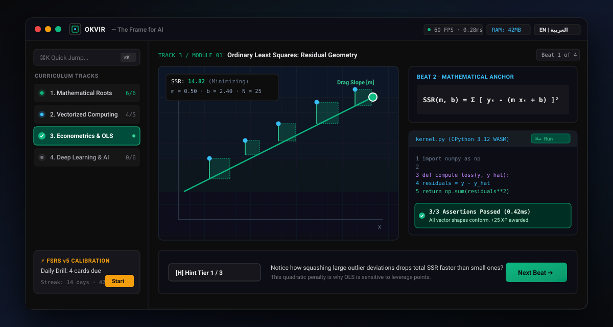

<div align="center">

# OKVIR
### The Open-Source, Interactive Desktop Framework for Learning Data Science, Econometrics & AI from the Ground Up

[](.github/workflows/ci.yml)
[](https://github.com/zuikre/okvir/releases)
[](LICENSE-MIT)
[](https://creativecommons.org/licenses/by-sa/4.0/)
[](#-download--installation)
[](#-bilingual-experience-english--العربية)
[](https://tauri.app/)
[-eab308.svg?style=flat-square&logo=python&logoColor=white)](https://pyodide.org/)
[-14b8a6.svg?style=flat-square)](#-instrument-grade-design-system)

<p align="center">
  <strong>Zero DevOps Setup. 100% Local-First. 60 FPS Visual Physics. Procedural Web Audio. Bilingual EN/AR. Under 28MB.</strong>
</p>

[**Download Desktop App**](https://github.com/zuikre/okvir/releases) • [**Architecture Specs**](ARCHITECTURE.md) • [**Curriculum Guide**](CURRICULUM_SPEC.md) • [**Contributing**](CONTRIBUTING.md)

<br><br>


</div>

---

## ⚡ The Zero DevOps Manifesto

Most people don’t quit Machine Learning because the mathematics is too difficult.

They quit because on **Day 1**, they spend 4 hours wrestling with Anaconda environment conflicts, broken `$PATH` configurations, incompatible GCC toolchains, and corrupt CUDA drivers before writing a single line of working code.

And when they finally get Python running? They are met with passive 45-minute video lectures and blackboard proofs that treat linear algebra like an abstract memorization drill instead of geometric intuition.

**Okvir** eliminates the DevOps tax on learning forever.

```
┌─────────────────────────────────────────────────────────────────────────────┐
│                             THE OKVIR SYNTHESIS                             │
├──────────────────────────────┬──────────────────────────────┬───────────────┤
│    BRILLIANT PEDAGOGY        │      DUOLINGO RETENTION      │  TAURI + WASM │
│ • Geometric intuition first  │ • 5-to-8 min micro-lessons   │ • <28MB base  │
│ • Reactive parameter sliders │ • Non-linear DAG tech tree   │ • 0s dev setup│
│ • 60fps algorithm animations │ • FSRS v5 spaced repetition  │ • 100% local  │
│ • "Touch the math" physics   │ • Non-childish streaks & XP  │ • 0-telemetry │
└──────────────────────────────┴──────────────────────────────┴───────────────┘
```

When you learn Linear Regression in Okvir, you don't memorize the OLS equation. You **drag the slope handle**, watch the residual error squares physically shrink at 60 frames per second, and write the 3-line NumPy vectorization that proves it.

---

## 🚀 Download & Installation

### One-Liner Quick Install

#### Linux & macOS
```bash
curl -fsSL https://raw.githubusercontent.com/zuikre/okvir/main/install.sh | bash
```

#### Windows (PowerShell)
```powershell
irm https://raw.githubusercontent.com/zuikre/okvir/main/install.ps1 | iex
```

### Local Development from Source
```bash
# 1. Clone the repository
git clone https://github.com/zuikre/okvir.git
cd okvir

# 2. Install dependencies
npm install

# 3. Start local development server (Vite + Web Worker WASM)
npm run dev

# 4. Or launch the native desktop shell (requires Rust 1.80+)
npm run tauri dev
```

---

## 🔬 Comparison Matrix: Why Okvir Wins

| Feature / Dimension | Brilliant.org | Duolingo | Jupyter / Colab | Coursera / Udemy | **OKVIR** |
| :--- | :--- | :--- | :--- | :--- | :--- |
| **Pricing** | $150+/year paywall | Freemium (Ads) | Free | $49–$79/month | **100% Free & Open-Source** |
| **Setup Friction** | Zero (Web) | Zero (Mobile) | Severe (Local envs) | Moderate | **Zero (One-click desktop)** |
| **Python Execution** | None (Abstract) | None | Full (Raw notebook) | Browser sandbox | **Full Local WASM (Pyodide)** |
| **Pedagogical Loop** | Visual Sliders | Gamified Drilling | None (Passive doc) | Video lectures | **4-Beat Tactile Micro-Loop** |
| **Deep AI Math** | Light / Broad | None | Code-only | Dense equations | **Geometric + Industrial Rigor** |
| **Audio & Haptics** | None | Recorded SFX | None | None | **Procedural Web Audio API** |
| **Privacy / Offline** | Cloud-only | Cloud-only | Cloud-reliant | Cloud-only | **100% Local-First & Offline** |
| **Community Extensibility**| Closed | Closed | Open (Files only) | Closed | **Open Git-Based Registry** |

---

## 🎯 The 4-Beat Cognitive Learning Loop & Scaffolding System

Every lesson in Okvir strictly adheres to Cognitive Load Theory ($4 \pm 1$ working memory limit) and executes the **4-Beat Micro-Loop**:

```
[Beat 1: Tactile Simulation] ──> [Beat 2: Reactive Math] ──> [Beat 3: Faded Code Lab] ──> [Beat 4: Transfer Quiz]
  "Touch the physics"          "Bret Victor KaTeX Pills"      "3-Tier Faded Scaffolding"    "Authentic Diagnostic"
```

1. **Beat 1: Tactile Intuition Simulation:** Explore geometry, distributions, and dynamics with real-time goal invariant tracking (`TargetedGoalManipulator` with $\Delta$ error feedback and audio celebration harmonics) *before* seeing formal notation.
2. **Beat 2: Bret Victor Reactive Formula Anchor:** The mathematical equation appears with live reactive symbol pills (`ReactiveFormulaAnnotator`). Hovering or clicking decomposes symbols into functional classes (parameters, observations, losses, hyperparameters) linked directly to the simulation state.
3. **Beat 3: 3-Tier Faded Scaffolding Code Lab:** Implement the computational kernel in Python (Pyodide WASM + Offline AST Micro-Evaluator) or DuckDB SQL with adaptive pedagogical scaffolding:
   * **Tier 1 (Parsons Puzzle):** Reorder and indent scrambled code blocks to master algorithmic control flow without syntax fatigue.
   * **Tier 2 (Skeleton Completion):** Fill-in-the-blank critical vectorization statements with structural guardrails.
   * **Tier 3 (Autonomous Lab):** Write production-grade implementations from scratch against real automated test assertions.
4. **Beat 4: Authentic Reality Transfer Challenge:** Dynamic conceptual diagnostic anchored directly to the module's mathematical invariant, featuring rigorous domain-specific distractors.

### 3-Tier Socratic Hint Ladder `[H]`
Never get stuck. Press `H` at any time to reveal a 3-tier scaffolding ladder:
* **Tier 1 (Metacognitive Nudge):** Prompts you to think about edge behaviors and mathematical relationships.
* **Tier 2 (Structural Scaffolding):** Deconstructs the problem into intermediate mathematical sub-goals.
* **Tier 3 (Bottom-Out Solution):** Complete solution with deep conceptual explanation.

---

## 🌌 The 4 Foundational Curriculum Tracks & Knowledge Constellation

Okvir features **125 comprehensive lessons** across 4 interconnected tracks (29 in Math, 30 in Programming, 33 in Econometrics, and 33 in Deep Learning), visualized through an interactive **3-mode pedagogical roadmap system**:

```
                  ┌───────────────────────────────┐
                  │ 📐 MATHEMATICAL FOUNDATIONS   │
                  │ • Vectors as Geometry         │
                  │ • Dot Product & Projections   │
                  │ • The Gradient Vector         │
                  │ • Bayes' Theorem & Priors     │
                  │ • Eigenvalues & Eigenvectors  │
                  │ • Central Limit Theorem (CLT) │
                  └──────────────┬────────────────┘
                                 │
                 ┌───────────────┴───────────────┐
                 ▼                               ▼
  ┌──────────────────────────────┐┌──────────────────────────────┐
  │ 💻 PROGRAMMING & DATA        ││ 📈 ECONOMETRICS & ML         │
  │ • SIMD NumPy Vectorization   ││ • OLS Residual Geometry      │
  │ • Columnar DataFrame Anatomy ││ • KNN Search Radar           │
  │ • SQL Window Functions & CTEs││ • K-Means Voronoi Tessellation│
  │ • CPython Memory & Refcounts ││ • Decision Tree Laser Cuts   │
  │ • Hash Table Open Addressing ││ • L1 vs L2 Regularization    │
  │ • Dynamic Array Geometric Res││ • Causal Confounding (Simpson)│
  └──────────────┬───────────────┘│ • Instrumental Variables 2SLS │
                 │                │ • DiD & Synthetic Controls   │
                 │                └──────────────┬───────────────┘
                 │                               │
                 └───────────────┬───────────────┘
                                 ▼
                  ┌───────────────────────────────┐
                  │ 🧠 DEEP LEARNING & MODERN AI  │
                  │ • Perceptrons & Activations   │
                  │ • 3D Loss Manifolds & Momentum│
                  │ • Spatial 2D Convolutions     │
                  │ • Transformer Self-Attention  │
                  │ • FlashAttention-2 SRAM Tiling│
                  │ • RoPE Rotary Positional Embed│
                  │ • LoRA Low-Rank Decomposition │
                  │ • OkvirGrad Reverse Autograd  │
                  │ • Byte-Pair Encoding (BPE)    │
                  └───────────────────────────────┘
```

### 🗺️ Tri-Modal Knowledge Navigation
1. **Organic Multi-Harmonic Serpentine Roadmap (`Roadmap`):** A natural topographic spline driven by multi-tier harmonic terrain equations ($h_1 + h_2 + h_3$) connecting modular checkpoints with tactile 3D pedestals, flowing energy particle dashes (`river-flow`), beacon ping animations for active lessons, and inward-facing lateral signpost cards (`w-36 sm:w-48`) featuring directional connector notches and zero-collision vertical pacing (`ROW_HEIGHT = 150px`).
2. **Interactive 2D Prerequisite DAG (`Constellation DAG`):** A cosmic 2D star-map spanning all 4 tracks with **166 validated acyclic directed prerequisite splines (0 cycles)**, reactive dependency highlights upon node hover/selection, and topological prerequisite resolution.
3. **Track Matrix Architecture (`Matrix`):** A side-by-side columnar view visualizing parallel track progression, mastery percentages, and curriculum completion.
4. **Hero Progression HUD:** Quick-launch next lesson via `Space`, live mastery percentages, streak counters, and W3C Open Badges 3.0 / Verifiable Credential claims.

---

## 🎨 Tactile 60 FPS Algorithmic Visualizations

Okvir includes **24 dedicated, zero-garbage-collection interactive simulation lab engines** mapping 97 unique simulation environments across the curriculum with zero unhandled fallbacks:

| # | Simulation Engine | Algorithm / Mathematical Principle | Interactive Mechanics |
| - | :--- | :--- | :--- |
| **1** | `LinearRegressionResiduals` | Ordinary Least Squares (OLS), FWL, Robust SE | Rotating regression line & shrinking $(y_i - \hat{y}_i)^2$ squares |
| **2** | `KNNRadar` | K-Nearest Neighbors, Metric Trees & ROC/AUC | Concentric radar scan wave, elastic neighbor tethers & voting donut |
| **3** | `GradientDescentCanvas` | Loss Manifolds, Contours, Chains & Curvature | 3D quadratic bowl, particle trajectory ribbons, $\eta$ & $\beta$ sliders |
| **4** | `KMeansVoronoi` | K-Means Clustering, PCA & Manifolds | Gliding centroids over 400ms & dynamic Voronoi cell boundary morphing |
| **5** | `DecisionTreeLaser` | Binary Axis-Aligned Recursive Partitions & GBDT | Orthogonal laser knife-cuts with spark particles minimizing Gini impurity |
| **6** | `VectorGeometryCanvas` | Euclidean Vector Spaces, Subspaces & Determinants | Interactive vector dragging, angle arcs & orthogonal projections |
| **7** | `BayesFrequencyTree` | Prior Odds, Likelihood & Posterior Updates | 10,000-person flow diagram with interactive disease prevalence sliders |
| **8** | `NeuralActivationCanvas` | Non-Linear Activation Functions & Sigmoids | Weight & bias knobs, dead-ReLU detector, Sigmoid, Tanh, LeakyReLU |
| **9** | `AttentionHeatmapCanvas` | Scaled Dot-Product Self-Attention & Transformers | Query, Key, Value matrix heatmaps with live pronoun coreference |
| **10** | `ConvolutionFilterCanvas` | 2D Spatial Convolutions, Kernels & Pooling | Sliding 3×3 kernel filter (Sobel, Blur, Edge) over 6×6 pixel grids |
| **11** | `RegularizationGeometryCanvas`| Ridge ($L_2$) vs Lasso ($L_1$) Sparsity | Expanding OLS loss contours striking the sharp corners of the $L_1$ diamond |
| **12** | `SimpsonsParadoxLab` | Causal Confounding, DAGs, DiD & RDD | Stratified cohort toggles, subgroup OLS lines, and cluster drag physics |
| **13** | `AnscombesQuartetLab` | Exploratory Data Analysis & Outliers | Real-time interactive point drag updating OLS line & HUD stats across 4 sets |
| **14** | `EigenHunterCanvas` | Eigenvalues, Spectral Theorem & SVD | Rotary probe vector dial hunting for non-rotating axes $Av = \lambda v$ |
| **15** | `GaltonBoardCltLab` | Central Limit Theorem (CLT) & Binomials | Triangular peg quincunx physics drops assembling empirical Gaussian bell curve |
| **16** | `InstrumentalVariablesLab` | Causal DAG, 2SLS, LATE & Synthetic Controls | Interactive causal DAG, relevance/exogeneity sliders & 2-stage regression |
| **17** | `AutogradGraphLab` | OkvirGrad Reverse-Mode Autograd DAG | Interactive computational DAG tracking forward values and reverse chain rule |
| **18** | `BpeTokenizerLab` | Byte-Pair Encoding (BPE) Subword Tokenizer | Character-level split, bigram frequency ranking, and greedy token merges |
| **19** | `FlashAttentionTilingLab` | FlashAttention-2 SRAM Memory Tiling | High-bandwidth HBM to low-latency SRAM block tiling & online softmax accumulator |
| **20** | `RotaryEmbeddingLab` | Rotary Position Embeddings (RoPE) | Multi-frequency 2D orthogonal Givens rotation planes preserving relative distance |
| **21** | `LoRADecompositionLab` | Low-Rank Adaptation (LoRA / QLoRA) | Weight freezing $W_0 \in \mathbb{R}^{d \times k}$ and rank-$r$ intrinsic adapter factorization $BA$ |
| **22** | `EnvironmentFrameCanvas` | CPython Memory, References, Scopes & Protocols | Dynamic stack frames, heap allocations, pointer aliasing, closures & refcounts |
| **23** | `DynamicArrayGrowthLab` | Geometric Vector Allocation, SIMD & Relational | Geometric buffer doubling ($0 \to 4 \to 8$), stride alignments & relational transforms |
| **24** | `HashTableInternalsCanvas` | Hash Table Buckets, Probing & Collision Entropy | Compact table array indexing, collision resolution & perturbation probing |

---

## 🎹 Procedural Web Audio API Synthesizer

Okvir contains **zero recorded audio files (0 MP3/WAV assets)**. All auditory feedback is synthesized mathematically in real time via the browser Web Audio API:
* **Mechanical Click:** 10ms damped triangle wave (1200Hz ➔ 300Hz) with 8ms subtle haptic pulse.
* **Success Chime:** Pentatonic overtone triad: C5 (523.25Hz), E5 (659.25Hz), G5 (783.99Hz) decaying smoothly.
* **Milestone Fanfare:** Ascending harmonic arpeggio (440Hz, 554Hz, 659Hz, 880Hz).
* **Boundary Error Tick:** 50ms downward sawtooth ramp (180Hz ➔ 60Hz).

---

## 🌐 Bilingual Experience: English & العربية

Okvir treats **Arabic (العربية)** alongside English as a first-class language:
* **Bidirectional Layout via CSS Logical Properties:** Sidebars, progress trees, and drawers mirror seamlessly when switching languages.
* **Strict LTR Isolation for Math & Code:** Formulas ($\text{SSR} = \sum e_i^2$) and Python blocks remain strictly Left-to-Right within Arabic narrative flow to prevent inverted operators or transposed parentheses.
* **Typographic Hierarchy:** `Inter Display` for English, `IBM Plex Sans Arabic` for Arabic narrative, and `JetBrains Mono` for code variables.

---

## <a id="instrument-grade-design-system"></a>📐 Instrument-Grade Design System

Okvir rejects the generic "AI Slop" aesthetic (purple gradients, glowing blobs, rounded cartoon buttons). Instead, it implements a dense, technical design language inspired by **Linear.app, Raycast, and Zed Editor**:

* **WCAG AAA Accessibility ($\ge 7:1$ Contrast):** High-contrast mathematical palette rigorously tested against deep charcoal backgrounds (`#09090b`) and pure paper light mode (`#fcfcfc`).
* **Zero Layout Jitter:** All numerical telemetry counters, coordinates, and formula scrubbers use `tabular-nums` monospace fonts to eliminate UI flickering during rapid scrubbing.
* **Typographic Rigor:** Engineered with `Inter Display` for UI prose, `IBM Plex Sans Arabic` for Arabic typography, and `JetBrains Mono` for computational kernels.
* **Demand-Driven Rendering:** 60 FPS simulations halt when parameters are stationary, keeping idle CPU usage strictly at `0.0%`.
* **Hardware Power Governor:** Dynamic battery telemetry listener via Battery Status API; drops simulation frame rates from 60 FPS to 30 FPS under low charge (<25%) to preserve battery life and prevent thermal throttling.
* **Tactile Haptic Synthesizer:** Micro-sound waveforms and subtle haptic pulses accompany parameter snapping and keystrokes.

---

## ⚙️ Architecture & Technical Specifications

```
OKVIR DESKTOP CLIENT
├── Native Desktop Shell (Tauri v2 / Rust 1.80+)
│   ├── Frameless Window CSD (OS-Adaptive: macOS Traffic Lights / Win & Linux Captions)
│   ├── In-App GitHub Releases Auto-Updater (Zero-telemetry community metrics)
│   ├── Native Spaced Habit Notifications (Tauri Plugin + Web Notification fallback)
│   ├── Package Manager (.okvir seekable Zstandard archives with Ed25519 Minisign)
│   ├── Hardware Power Governor (Battery Status API & 30 FPS / 60 FPS frame throttling)
│   └── Storage: Embedded SQLite engine (WAL mode)
├── Presentation Layer (React 18/19 / Vite / Tailwind CSS)
│   ├── Titlebar Command Center: Telemetry HUD, Notification Center Popover, Quick Settings
│   ├── Typographic Math: KaTeX with strict LTR isolation & Bret Victor pills
│   ├── Procedural Audio: Web Audio API mathematical synthesizer
│   ├── 24 Tactile 60 FPS Visual Canvases: HTML5 2D Canvas + WebGL (0 unhandled fallbacks)
│   └── Adaptive Scaffolding: 3-Tier Faded Scaffolding (Parsons, Skeleton, Autonomous Lab)
└── In-App Dual Execution Sandbox (Dedicated Web Worker)
    ├── WebAssembly CPython 3.12 (Pyodide v0.26+)
    │   ├── 5-Second Infinite Loop Hard Watchdog & Linear Memory Recycling
    │   ├── Non-destructive interrupt buffer (SharedArrayBuffer)
    │   ├── Offline wheels: NumPy, Pandas, Scikit-learn, SciPy
    │   └── Origin Private File System (OPFS) / MEMFS mounts
    ├── DuckDB WebAssembly (v1.28.0)
    │   ├── Zero-latency in-memory relational SQL engine
    │   ├── Seeded enterprise tables (employees, orders, departments)
    │   └── Full SQL:2016 Window Functions, CTEs, Joins & Aggregations
    └── Offline AST Micro-Evaluator
        ├── Zero-dependency Python unit test assertion parser
        └── Complete elimination of auto-pass loopholes when CDN is disconnected
```

### Concrete Benchmarks (Intel Core i3, 4GB RAM)
* **Base Installer Size:** `< 28 MB` (vs. 160MB+ for Electron apps)
* **Cold Startup Time:** `< 480 ms`
* **Idle RAM Footprint:** `< 50 MB`
* **Active Simulation RAM:** `< 250 MB` (with Pyodide + NumPy loaded; safe under 350MB ceiling)
* **Idle CPU Utilization:** `0.0%` (demand-driven animation loops)
* **Live In-App Telemetry HUD:** Real-time FPS & frame budget (<0.3ms execution) counter with linear memory recycling

For exhaustive technical blueprints, read our [System Architecture Guide](ARCHITECTURE.md).

---

## ⌨️ Instrument-Grade Keyboard Navigation & Vim Bindings

Okvir features a keyboard-first ergonomics system inspired by Linear, Raycast, and Zed:

| Shortcut | Action | Scope / Context |
| :--- | :--- | :--- |
| `⌘K` / `Ctrl+K` | Open Universal Command Palette | Global |
| `F11` | Toggle Native Borderless Fullscreen Mode | Global |
| `⌃⇧H` / `Ctrl+Shift+H` | Toggle Real-Time Hardware Telemetry HUD | Global |
| `j` / `↓` | Cycle next module in Constellation / Navigate next lesson in Workbench | Constellation / Workbench |
| `k` / `↑` | Cycle previous module in Constellation / Navigate previous lesson in Workbench | Constellation / Workbench |
| `↵` (Enter) | Launch selected module | Constellation DAG |
| `Space` | Quick-start recommended lesson or advance to next beat | Constellation / Workbench |
| `H` / `h` | Reveal & advance Progressive Socratic Hint Ladder | Workbench |
| `⌘↵` / `Ctrl+↵` | Execute Python / SQL code challenge kernel | Workbench Code Lab |
| `D` | Jump to Daily Calibration Drill (FSRS v5 Spaced Repetition) | Global |
| `M` | Toggle procedural Web Audio synthesis | Workbench / Global |
| `Esc` | Return to Knowledge Constellation | Workbench / Sandbox / Review |
| `?` | Toggle Raycast Floating Action Bar | Global |

---

## 🛠️ Framework CLI (`okvir-cli`)

Okvir ships with a dedicated developer CLI (`bin/okvir.js`) implementing PRD Section 15 for authoring, linting, testing, and compiling community curriculum modules:

```bash
# 1. Scaffold a new interactive curriculum repository
okvir init my-course

# 2. Launch live-reload interactive lesson previewer
okvir dev

# 3. Validate all .okvir.md lesson schemas and AST directives
okvir test ./curriculum

# 4. Compile lesson assets into seekable .okvir archive with Ed25519 Minisign signature
okvir pack ./curriculum ./dist/course.okvir

# 5. Cryptographically inspect and verify .okvir binary package integrity
okvir verify ./dist/course.okvir

# 6. Explore decentralized community curriculum packs
okvir registry [query]
```

For authoring guidelines, see our [Curriculum Authoring Specification](CURRICULUM_SPEC.md).

---

## 🛡️ Security & Privacy

* **100% Offline & Local-First:** All progress, code submissions, and spaced repetition intervals are stored in local SQLite. Zero tracking, zero telemetry.
* **WASM Sandboxing:** Python executes strictly inside a sandboxed Web Worker without host filesystem access.
* **Cryptographic Signing:** Curriculum packs are signed with Ed25519 `minisign` keys.

For vulnerability reporting, see [SECURITY.md](SECURITY.md).

---

## 📜 Licensing

* **Application Engine (Rust, Tauri, React, Simulators):** Dual-licensed under [MIT](LICENSE-MIT) OR [Apache-2.0](LICENSE-APACHE).
* **Pedagogical Curriculum & Educational Assets:** Licensed under [Creative Commons Attribution-ShareAlike 4.0 International (CC-BY-SA 4.0)](https://creativecommons.org/licenses/by-sa/4.0/).

---

## 👨‍💻 Founder & Architectural Vision

**Zakarya Roubhi (روبحي زكرياء)**  
*Data Scientist • Valedictorian MSc Data Science (ESE Oran) • Co-Founder & CTO of Podacium*  
*Founder & Benevolent Dictator for Life (BDFL) of Okvir*

> *"Let’s build the next generation of data scientists on intuition, not memorization."*

---

<div align="center">
  <sub>Built with precision for students, researchers, and engineers worldwide.</sub><br>
  <sub>⭐ Star us on GitHub to support free, open-source AI education!</sub>
</div>
